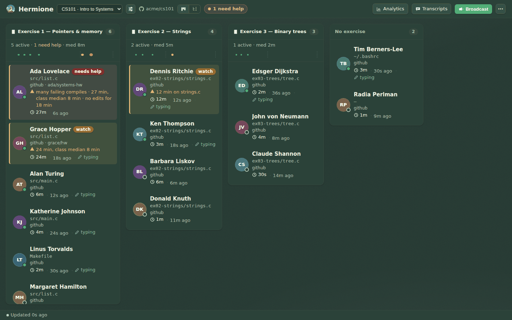
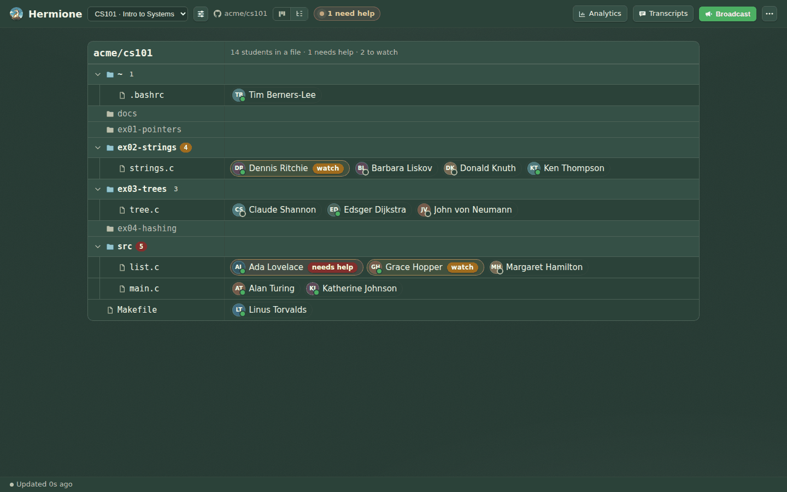
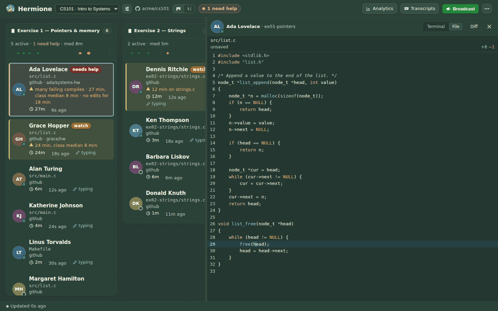
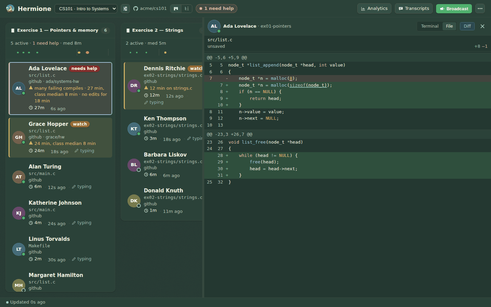
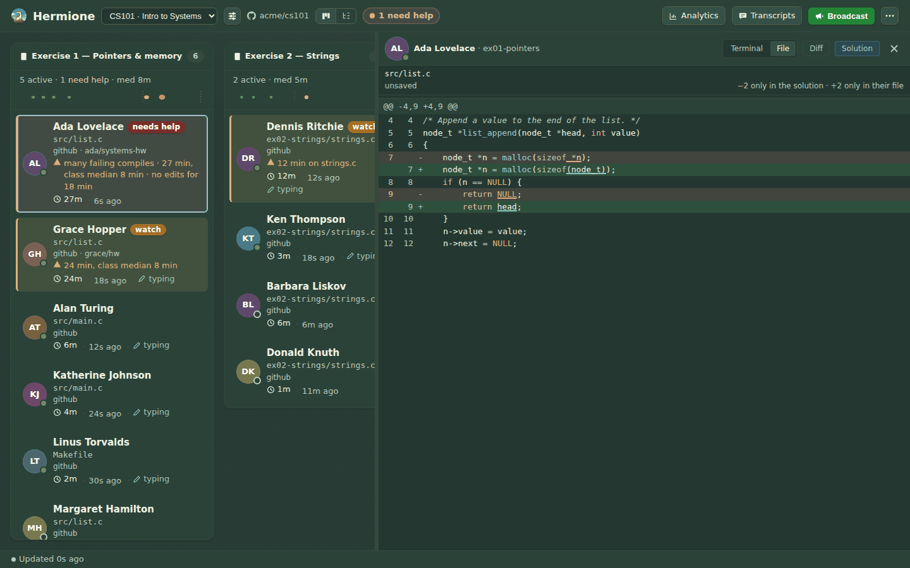
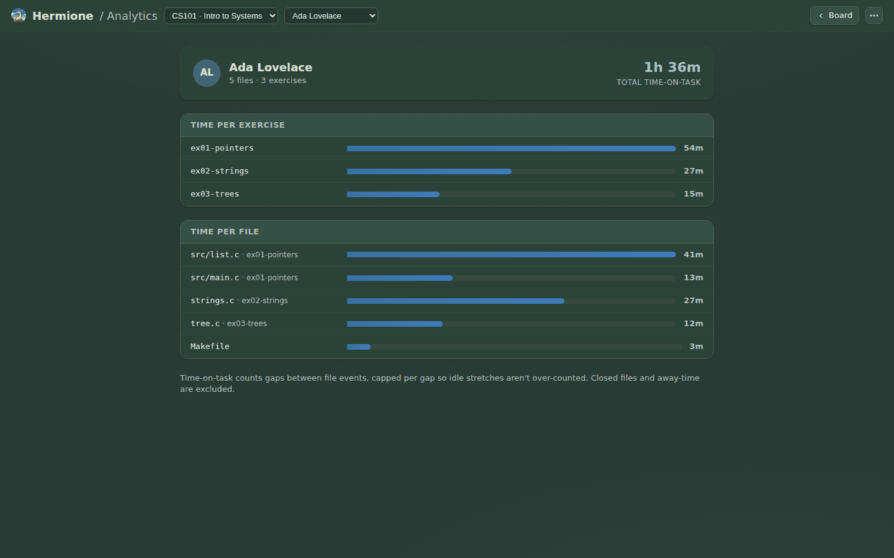

# Teacher's guide

What you see on the dashboard, and what your students' editors share to make it
possible. For setting Hermione up, see the [README](../README.md); the pictures
below are the chalkboard (dark) theme, and every page also has a whiteboard
(light) theme, switched from the **⋯** menu.

## The board

Students are grouped by the exercise they are working on, one column each. A card
shows the file they have open, how long they have been on the exercise, and how
long ago they last did anything.

- **Needs help** (red) and **watch** (amber) are how the board says "look here
  first". They are worked out from what the terminal shows (errors, failed runs),
  how long a student has been on the exercise compared with the rest of the class,
  and how long they have gone without typing. Those thresholds are set per
  exercise from how the class is actually doing, so a hard exercise doesn't flag
  everyone.
- **Typing** means the student has made edits in the last few minutes (hover it for
  the count). A big clock on someone who is still typing is usually work, not being
  stuck, so typing softens the flag.
- The **1 need help** count in the top bar is the whole course at a glance.
- Click a student to open their pane. Several panes tile side by side.

### Going round the room: **N**

Press **N** to open the flagged student you have not been to yet — the worst
first (needs help before watch, then whoever has been at it longest). Each one you
open gets a **✓** on their flag, so pressing **N** again moves on to the next
person rather than showing you the same red card. When nobody is left it says so.
A student who gets worse after you have seen them (watch → needs help), or who
recovers and needs help again later, is unseen again.

The browser tab shows how many are still waiting — **(2) Hermione** — so you can
leave it in the background. In **⋯ → Alert me when someone needs help** you can
ask for a desktop notification the moment a student newly needs help; it only
fires while the tab is in the background, once per student.

What you have seen is remembered by this browser (per course, for the day). A
co-teacher's browser keeps its own.

## The tree view

The switch beside the course name, its right-hand button, changes from the board
to the tree. It shows the course repository as folders and files, with each
student on the file they have open right now. It answers "who is in `list.c`?"
and "is anyone touching `ex04` yet?" at a glance.

- A folder shows how many students are inside it, in red or amber when any of them
  needs help or is worth watching, so a collapsed folder still tells you.
- Folders nobody is in are dimmed. Click a folder (or press Enter or Space on it)
  to collapse it; your choice is remembered per course.
- Click a student to open their pane, on their file.

## A student's pane

Each pane has a **Terminal / File** switch, and **Diff** (and **Solution**, where the course has reference solutions) when a file is showing.

### Terminal

Their terminal session, replayed and then live.

### File

The file as the student sees it this instant, unsaved edits included, with syntax
highlighting and a marker on the line their cursor is on. The line under the path
tells you whether the buffer is **unsaved**, whether it was **truncated** (files
over 256 KB are cut), and how old the snapshot is.

### Diff

**Diff** shows the working changes against the student's last commit, in the style
of GitHub's diff: added and removed lines are washed green and red, and the
syntax colours are left alone. Inside an edited line, the words that actually
changed are underlined, so `malloc(8)` → `malloc(sizeof(node_t))` shows what moved
rather than only which lines. It includes changes they haven't saved.

It says when there is nothing to compare with:

- *hasn't committed this file yet* — a new file with no earlier version.
- *No git baseline for this file* — a notebook cell, or a folder that isn't a git
  repository.
- *No changes since their last commit.*
- *The diff is too large to show.* Very large changes are cut rather than sent
  whole.

### Since you last looked

Did your hint work? Open a student's file, say what you like, close the pane, and
come back later: **Since last look** shows exactly what changed in that file since
you last had it open — additions in green, removals in red, with a few lines of
context, and how long ago you looked.

This browser keeps the file as it was when you closed the pane (or the tab), for
the last few files per student, for a day. It is kept only in your browser: the
server stores nothing extra, and a co-teacher's browser has its own memory. The
button appears once there is a previous look to compare with; a file too large to
compare says so.

### Solution

When the course has reference solutions, **Solution** appears beside **Diff**. It
compares the student's file with the solution at the same path and answers the
question a teacher usually has: *how far is this from right?* A file that matches
says so with a tick; one that doesn't is drawn as the same rows as **Diff**, but
read the other way round:

- a red **−** row is a line **only the solution has** — something the student's
  file is missing or wrote differently;
- a green **+** row is a line **only the student's file has**.

As in **Diff**, the words that changed inside a line are underlined. Line endings
and a missing final newline aren't counted as differences.

To set it up, open **Course settings** and fill in *Reference solutions*: a branch,
tag or commit, a folder, or both, in the course's linked GitHub repository. A
student's `ex01/list.c` is looked up as `<folder>/ex01/list.c` on that branch.
Leave both empty to switch it off.

**Keep the solutions hidden from students.** The repository is what they clone, so
a solutions branch or folder there must not be readable by them — use a branch
protected from students, a private fork, or a repository they can't see. Hermione
reads it with its own credentials and shows it to teachers only; a student's editor
never receives it.

When there is nothing to compare with, the pane says why: the course has no
solutions set up, no repository is linked (or it isn't on GitHub), the solutions
have no file for this one, GitHub refused or couldn't be reached (a mistyped branch
reads as *not found*), or the student's file is too large to compare.

### When there is no file to show

The pane says why instead of staying blank:

| It says | Because |
|---|---|
| *Asking …'s editor…* | the request has just gone out; the answer usually arrives within a second |
| *…'s editor isn't connected* | the VSCode extension isn't running on their machine |
| *…has file sharing turned off* | they have switched sharing off (see below) |
| *…has no file open* | sharing is on, but no editor tab is open |
| *Lost the connection to the server — retrying…* | your browser can't reach the server; the last file stays on screen |

## The top bar, and the status bar

The bar holds what you use all class: the course, the board/tree switch, Analytics,
Transcripts and Broadcast. What you use once a term — **New course**, **Assistant
settings**, the theme and **Sign out** — is behind the **⋯** menu. On a narrow
window the labels drop away before any control does, so nothing is ever cut off.

**Projector mode** is two switches in the **⋯** menu, on every teacher page and
remembered by the browser. **Larger text** enlarges the type (terminals included).
**Blur student names** hides names until the pointer or keyboard focus is on that
student's card, row or pane, so a mirrored screen doesn't show the class each
other's names while you can still tell who is who. Initials are hidden too.

The strip along the bottom says how fresh the board is (*Updated 2s ago*) and shows
the one-time hint for new users.

## Analytics, Transcripts and Broadcast

- **Analytics** — time on task for one student, per exercise and per file. It counts
  the gaps between file events, capped per gap, so a lunch break isn't counted as
  work.
- **Transcripts** — the conversations students have had with the teaching
  assistant, by student, so you can see where the assistant is (or isn't) helping.
- **Broadcast** — a message delivered into students' editors. Choose who it is
  for: everyone in the course, only the students who need help, everyone on one
  exercise, or a handful you pick by name. A message to some students is private
  to them: other students' editors, and the dashboard, never see it. An editor
  that was closed when you sent it gets it when it reconnects.

## What students share

Seeing a file is the most sensitive thing on this dashboard, so it is deliberately
narrow:

- **Only while you are looking.** A student's editor is asked for the file only
  while you have their **File** pane open. Close the pane and nothing more is sent.
- **Nothing is stored.** The latest snapshot is held in memory on the server for a
  few minutes and never written to the database.
- **They can see it, and stop it.** Their status bar says *teacher viewing*
  whenever it is happening. Either side can switch file sharing off: the student
  with the `hermione.shareFileContents` setting, or you with
  `"shareFileContents": false` in the course's `.hermione.json`. When it is off, the
  pane says so rather than showing anything.
- **Only their own name is trusted.** Where student sign-in is enforced, which
  student a request is about comes from their verified identity, not from what the
  editor claims, so one student's editor can't be made to answer for another's.

Which file a student has open, which exercise it belongs to and how long they have
been on it are reported separately, as they always have been, and are not affected
by the file-sharing switch.
